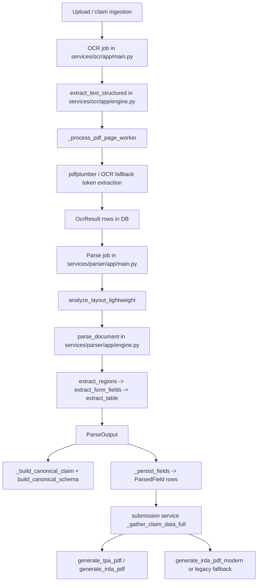

# ClaimGPT Live Parsing Architecture Audit

Scope: this report traces the current live pipeline as it exists in code today. It does not propose extraction changes.

## Bottom Line

The live parser is not using the PP-StructureV3 path described in the layout module. The active job path is:

OCR service -> token persistence in OcrResult -> parser job -> lightweight coordinate layout -> modular parser -> ParsedField rows -> submission service rebuilds claim data -> PDF renderer.

The canonical JSON emitted by the parser is debug-only. It is not consumed by the renderer. The renderer reads the database again, reconstructs its own claim payload, and applies additional regex / fallback logic in the submission service.

The main corruption points today are:

1. Hospitalization fields can be present in OCR text but disappear before persistence because the live parser ignores the layout output and never routes hospitalization sections into form extraction.
2. Patient-name noise can originate in OCR and then be preserved unchanged by downstream stages.
3. Expense rows can disappear at the layout/table gate if the bill table is not recognized or if row filtering rejects them.
4. The PP-StructureV3 module exists, but it is not on the live job path.

## Current Live Architecture

## Exact Runtime Trace

### 1) OCR processing and token extraction

The workflow orchestrator starts the OCR step from [services/workflow/app/pipeline.py](services/workflow/app/pipeline.py#L46) and waits on the OCR job status endpoint. The OCR background worker is `_run_ocr_job` in [services/ocr/app/main.py](services/ocr/app/main.py#L366).

Inside `_process_single_document` in [services/ocr/app/main.py](services/ocr/app/main.py#L473), OCR calls `extract_text_structured(file_path)` from [services/ocr/app/engine.py](services/ocr/app/engine.py#L646). For PDFs, that flows through `_extract_from_pdf` and `_process_pdf_page_worker` in [services/ocr/app/engine.py](services/ocr/app/engine.py#L646-L775).

The token flow is:

1. PDF embedded text via pdfplumber.
2. PDF table extraction via pdfplumber.
3. Word-level tokens via `page.extract_words()` when available.
4. Tesseract token fallback when no pdfplumber tokens exist.
5. PaddleOCR token fallback in other branches of the OCR engine.

The token helpers that synthesize or normalize coordinates are `_tokens_from_tesseract_data` and `_tokens_from_paddle_result` in [services/ocr/app/engine.py](services/ocr/app/engine.py#L1204-L1303). If the OCR engine does not provide boxes, those paths can emit `x0/y0/x1/y1 = 0.0`.

The OCR service persists each page to `OcrResult` with `text` and `tokens` in [services/ocr/app/main.py](services/ocr/app/main.py#L541-L542). Those DB rows are the input to parsing.

### 2) Parser invocation and layout analysis

The parser job starts in `_run_parse_job` in [services/parser/app/main.py](services/parser/app/main.py#L421). It first gathers OCR pages from `OcrResult`, then gathers token-level OCR into `ocr_tokens`, then calls `analyze_layout_lightweight` from [services/parser/app/layout_analyzer_lightweight.py](services/parser/app/layout_analyzer_lightweight.py#L208).

Important detail: this job does not call `services/parser/app/layout_analyzer.py`. The PP-StructureV3 module exists, but it is not the live entrypoint.

The parse job then calls `parse_document(ocr_pages, layout=layout, images=None)` in [services/parser/app/main.py](services/parser/app/main.py#L541).

### 3) Modular parser execution

`parse_document` is defined in [services/parser/app/engine.py](services/parser/app/engine.py#L24). It is the actual parser used by the job.

The function does the following:

1. Flattens all tokens from all pages into `all_tokens`.
2. Calls `extract_regions(all_tokens)` from [services/parser/app/layout_engine.py](services/parser/app/layout_engine.py#L23).
3. Takes only sections with `type == 'patient_info'` and passes their tokens into `extract_form_fields` from [services/parser/app/form_extractor.py](services/parser/app/form_extractor.py#L10).
4. Takes only sections with `type == 'bill_table'` and passes them into `extract_table` from [services/parser/app/table_extractor.py](services/parser/app/table_extractor.py#L5).
5. Builds `FieldResult` objects for normal form fields and for each extracted expense row.
6. Returns `ParseOutput` with fields, tables, sections, page_objects, model_version, and `used_fallback=False`.

Critical observation: the `layout` argument passed into `parse_document` is unused. The function ignores the lightweight layout result and recomputes regions internally with `extract_regions(all_tokens)`.

### 4) Canonical normalization

Canonical JSON is built in `_build_canonical_claim` in [services/parser/app/main.py](services/parser/app/main.py#L266), which calls `build_canonical_schema` from [services/parser/app/schema_normalizer.py](services/parser/app/schema_normalizer.py#L1).

This canonical object is written only to debug artifacts in `_write_parse_debug_dump` in [services/parser/app/main.py](services/parser/app/main.py#L321). It is not written back to a database table and not consumed by the submission service.

### 5) Renderer generation

The submission service is the live consumer for PDF generation. It rebuilds its own claim payload in `_gather_claim_data_full` in [services/submission/app/main.py](services/submission/app/main.py#L308) and then calls `generate_tpa_pdf` in [services/submission/app/tpa_pdf.py](services/submission/app/tpa_pdf.py#L587) or `generate_irda_pdf` in [services/submission/app/irda_pdf.py](services/submission/app/irda_pdf.py#L1360).

For IRDA output, `generate_irda_claim_pdf` can prefer `generate_irda_pdf_modern`, but falls back to the legacy renderer if modern generation fails or is unavailable in [services/submission/app/main.py](services/submission/app/main.py#L788-L799).

## Which Parser Paths Actually Execute

### Active

- `services/ocr/app/main.py` `_run_ocr_job` and `_process_single_document`
- `services/ocr/app/engine.py` `extract_text_structured`, `_extract_from_pdf`, `_process_pdf_page_worker`
- `services/parser/app/main.py` `_run_parse_job`
- `services/parser/app/layout_analyzer_lightweight.py` `analyze_layout_lightweight`
- `services/parser/app/engine.py` `parse_document`
- `services/parser/app/layout_engine.py` `extract_regions`
- `services/parser/app/form_extractor.py` `extract_form_fields`
- `services/parser/app/table_extractor.py` `extract_table`
- `services/parser/app/schema_normalizer.py` `build_canonical_schema`
- `services/submission/app/main.py` `_gather_claim_data_full`
- `services/submission/app/tpa_pdf.py` `generate_tpa_pdf`
- `services/submission/app/irda_pdf.py` `generate_irda_pdf`

### Still present but not on the live job path

- `services/parser/app/layout_analyzer.py` `analyze_layout` and its PP-StructureV3 initialization path
- `services/parser/app/layout_analyzer.py` `_heuristic_page_sections`
- `services/parser/app/main.py` legacy docstring text that references LayoutLMv3 / heuristic fallback

## Concrete Claim Trace

The concrete debug artifact in [tmp/parser_debug/8222d934-9651-4aa3-bd81-2a803729b6f6_049b6594-efbf-48fe-9704-cf02e2ab2065.json](tmp/parser_debug/8222d934-9651-4aa3-bd81-2a803729b6f6_049b6594-efbf-48fe-9704-cf02e2ab2065.json) shows a claim with:

- `claim_id = eb3222f2-da2a-4baf-b22c-987dd0061f31`
- `job_id = 049b6594-efbf-48fe-9704-cf02e2ab2065`
- `model_version = modular-parser-v1`

### Field 1: patient_name

OCR text in the debug dump shows `Patient Name: Ms. Elfreda431 Beahan375` in [tmp/parser_debug/8222d934-9651-4aa3-bd81-2a803729b6f6_049b6594-efbf-48fe-9704-cf02e2ab2065.json](tmp/parser_debug/8222d934-9651-4aa3-bd81-2a803729b6f6_049b6594-efbf-48fe-9704-cf02e2ab2065.json#L1).

Pipeline path:

1. OCR extracts the noisy text unchanged.
2. `extract_regions` places the top-of-page tokens into a `patient_info` section.
3. `extract_form_fields` matches the `patient_name` anchor and returns `Ms. Elfreda431 Beahan375`.
4. `parse_document` emits a `FieldResult(patient_name=...)`.
5. `_persist_fields` writes a `ParsedField` row.
6. `_build_parsed_field_map` preserves that value.
7. `generate_tpa_pdf` and `generate_irda_pdf` render the same noisy string.

Corruption source: OCR, not the parser. The downstream code preserves the OCR text as-is.

### Field 2: hospital_name

OCR text in the same debug dump shows `Hospital Name: NEVILLE CENTER AT FRESH POND FOR NURSING & REHAB` in [tmp/parser_debug/8222d934-9651-4aa3-bd81-2a803729b6f6_049b6594-efbf-48fe-9704-cf02e2ab2065.json](tmp/parser_debug/8222d934-9651-4aa3-bd81-2a803729b6f6_049b6594-efbf-48fe-9704-cf02e2ab2065.json#L1).

Pipeline path:

1. OCR has the correct value in page text.
2. The live job computes `layout = analyze_layout_lightweight(...)`, and that layout does contain `hospitalization_info` in the lightweight analyzer code.
3. `parse_document` ignores the `layout` argument and recomputes regions with `extract_regions(all_tokens)`.
4. `extract_regions` in [services/parser/app/layout_engine.py](services/parser/app/layout_engine.py#L23) does not create a hospitalization section at all.
5. `parse_document` only runs `extract_form_fields` on `patient_info` regions, so `hospital_name` never reaches form extraction.
6. No `ParsedField(hospital_name=...)` is persisted.
7. The submission preview tries a fallback import of `_extract_hospital_name_fallback`, but that symbol is not defined anywhere in the workspace, so the fallback path is effectively dead.

Corruption source: parser routing. The OCR is correct; the parser loses the value because the live modular path never consumes the hospitalization section.

### Field 3: total_amount

The canonical claim shows `claims.total_amount = 173049.0` in [tmp/parser_debug/8222d934-9651-4aa3-bd81-2a803729b6f6_049b6594-efbf-48fe-9704-cf02e2ab2065_canonical_claim.json](tmp/parser_debug/8222d934-9651-4aa3-bd81-2a803729b6f6_049b6594-efbf-48fe-9704-cf02e2ab2065_canonical_claim.json).

Pipeline path:

1. `extract_table` returns 7 line items for the bill table.
2. `_build_canonical_claim` collects those rows into `table_data`.
3. `build_canonical_schema` computes `total_amount` as the sum of the extracted row amounts.
4. The renderer input carries the same canonical total in [tmp/parser_debug/8222d934-9651-4aa3-bd81-2a803729b6f6_049b6594-efbf-48fe-9704-cf02e2ab2065_renderer_input.json](tmp/parser_debug/8222d934-9651-4aa3-bd81-2a803729b6f6_049b6594-efbf-48fe-9704-cf02e2ab2065_renderer_input.json#L12058).
5. The final render audit also reports `total_amount = 173049.0` in [tmp/parser_debug/8222d934-9651-4aa3-bd81-2a803729b6f6_049b6594-efbf-48fe-9704-cf02e2ab2065_final_render_audit.json](tmp/parser_debug/8222d934-9651-4aa3-bd81-2a803729b6f6_049b6594-efbf-48fe-9704-cf02e2ab2065_final_render_audit.json).

Corruption source: none in this sample. The amount survives parser -> canonical -> renderer.

### One expense row

The first expense row in the canonical claim is:

- `description = Charges General Ward – 1 Days`
- `category = Room`
- `amount = 8000.0`

Pipeline path:

1. OCR text on page 2 contains the row in the debug dump.
2. `extract_regions` identifies a `bill_table` section.
3. `extract_table` converts the row into a structured line item.
4. `parse_document` emits a table row and a JSON field `expense_table_row_1`.
5. `_build_canonical_claim` includes the row in `expenses.line_items`.
6. `_gather_claim_data_full` rebuilds the expense list from `ParsedField` rows whose `model_version` starts with `expense-table`.
7. `generate_tpa_pdf` renders the item in section 7.

Corruption source: none in this sample. The row survives all stages.

## Fallback Inventory

### OCR-level fallback paths still active

- pdfplumber embedded text extraction.
- pdfplumber table extraction.
- `page.extract_words()` for token geometry.
- Tesseract token fallback when pdfplumber does not provide words.
- PaddleOCR token fallback in OCR-engine branches.
- These fallback paths can emit zeroed coordinates when boxes are unavailable.

### Parser-level fallback paths still active

- Lightweight layout detection is always used in the live parse job.
- PP-StructureV3 exists in `services/parser/app/layout_analyzer.py`, but it is not the live path.
- `_heuristic_page_sections` exists as a local fallback helper, but it is not used by the live job path.
- `parse_document` does not use its `layout` argument, so there is no layout-consumption fallback.

### Submission / renderer fallback paths still active

- `generate_irda_claim_pdf` falls back from modern to legacy IRDA rendering if the modern renderer fails.
- `_gather_claim_data_full` falls back to PDF text extraction if OCR text is missing.
- `_gather_claim_data_full` runs OCR-text regexes for gross total and subtotal anchors.
- `_gather_claim_data_full` tries to import `_extract_hospital_name_fallback`, but that symbol is not defined in the workspace, so the fallback is not actually available.

## Dead or Unreachable Paths

These are present in the repo but are not part of the current live parser workflow:

- [services/parser/app/layout_analyzer.py](services/parser/app/layout_analyzer.py) PP-StructureV3 startup and inference path.
- [services/parser/app/layout_analyzer.py](services/parser/app/layout_analyzer.py) `_heuristic_page_sections`.
- The `layout` parameter on [services/parser/app/engine.py](services/parser/app/engine.py#L24) `parse_document`, which is currently ignored.
- The legacy docstring in [services/parser/app/main.py](services/parser/app/main.py#L644) that mentions LayoutLMv3 / heuristic fallback.
- The architecture narrative in [PARSER_ARCHITECTURE.md](PARSER_ARCHITECTURE.md) that describes an LLM / LayoutLM / regex stack does not match the live job path.

## Stale or Risky Reuse Points

These are not caches in the strict sense, but they are the places where current DB state can be reinterpreted or overwritten:

- `services/parser/app/main.py` deletes old `ParsedField` rows before inserting fresh ones.
- `services/parser/app/main.py` uses `set_hash` to prevent duplicate document sets from being parsed as distinct jobs.
- `services/parser/app/main.py` blocks older parse jobs from overwriting newer ones.
- `services/ocr/app/main.py` skips duplicate OCR results by `content_hash`.
- `services/submission/app/main.py` can rewrite `ParsedField` rows directly through `update_claim_fields` and `update_claim_expenses`.

So there is no parser debug dump reuse in the live flow, but the database itself is always the authoritative source for preview and rendering.

## Root Causes Still Remaining

1. Hospitalization extraction is not wired into the live modular parser path.
2. Layout analysis output is computed but not consumed by the parser.
3. The live parser is still built from heuristic sectioning and table parsing helpers rather than the PP-StructureV3 module.
4. Renderer generation does not consume canonical JSON; it reconstructs claim data from DB rows and OCR text.
5. Renderer-side fallback logic can mask parser gaps instead of exposing them.

## What This Means Operationally

- If OCR is noisy, that noise survives unless a downstream stage explicitly normalizes it.
- If a field is not in the sections that `extract_regions` emits, it will not be persisted.
- If a table row does not match the bill-table heuristics, it will vanish before canonicalization.
- If canonical JSON looks correct in a debug file, that does not guarantee the renderer used it.

## Recommended Interpretation of the Current State

The live pipeline is effectively a hybrid of:

- OCR with multiple token fallbacks.
- A coordinate-native heuristic layout gate.
- A modular but still heuristic parser.
- A submission service that reinterprets DB rows and OCR text.
- A PDF renderer that formats the submission service payload.

PP-StructureV3, LayoutLMv3, and the older regex-driven architecture are not authoritative in the current runtime path.