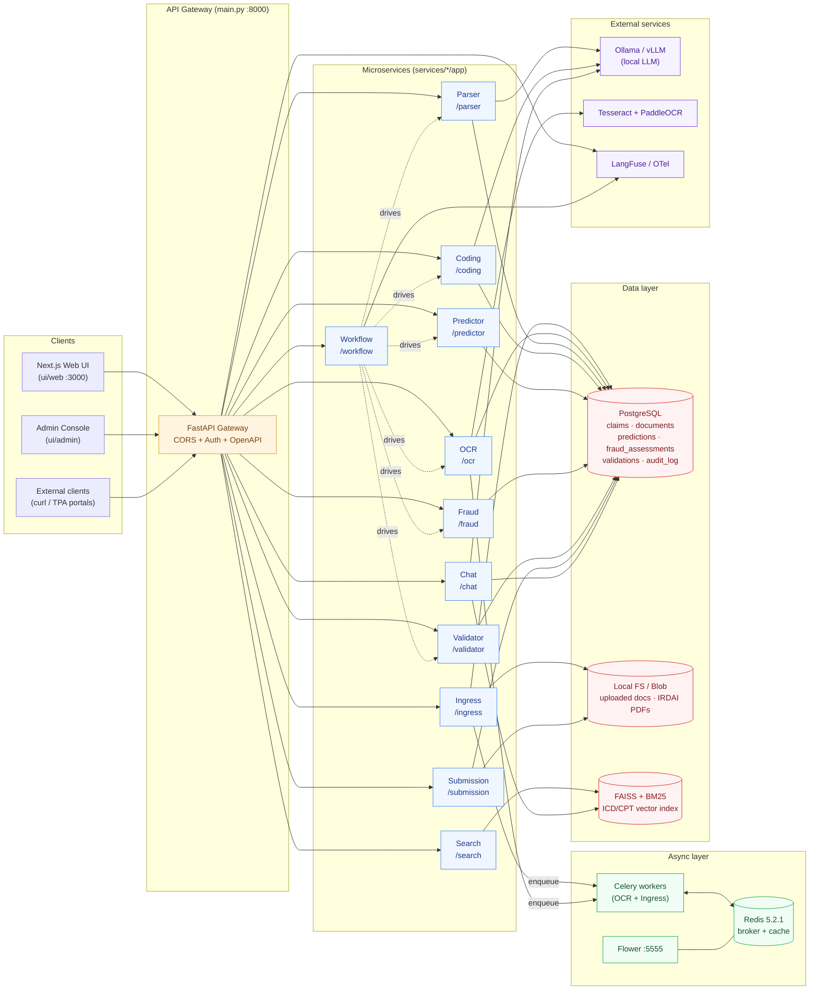
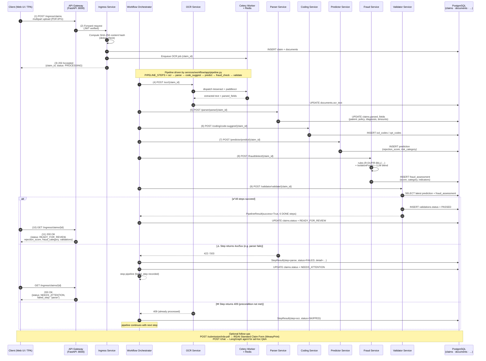

# ClaimGPT — Architecture

> Two views of the system:
> 1. **Component diagram** — services, datastores, and external integrations.
> 2. **Sequence diagram** — end-to-end claim processing flow (upload → OCR → parse → code → predict → fraud → validate → submit), styled after the Azure AD JWT auth flow we use as a reference.
>
> Both diagrams render natively on GitHub. To preview locally in VS Code install `bierner.markdown-mermaid` or use the **Markdown: Open Preview** command.

---

## 1. Component Diagram

### Service registry (from `main.py`)

| Prefix        | Module                              | Purpose                                                             |
| ------------- | ----------------------------------- | ------------------------------------------------------------------- |
| `/ingress`    | `services.ingress.app.main`         | Claim creation, document upload, deduplication, activity log.       |
| `/ocr`        | `services.ocr.app.main`             | Tesseract + PaddleOCR text extraction (Celery-backed).              |
| `/parser`     | `services.parser.app.main`          | LLM-based field extraction (patient, policy, diagnosis…).           |
| `/coding`     | `services.coding.app.main`          | ICD-10 / CPT code suggestion (BioGPT + RAG).                        |
| `/predictor`  | `services.predictor.app.main`       | XGBoost + LightGBM ensemble — rejection-risk score.                 |
| `/fraud`      | `services.fraud.app.main`           | 10 rule detectors + IsolationForest + LLM blend.                    |
| `/validator`  | `services.validator.app.main`       | R001–R011 rules; consumes predictor + fraud scores.                 |
| `/workflow`   | `services.workflow.app.main`        | 6-step pipeline orchestrator (`PIPELINE_STEPS`).                    |
| `/submission` | `services.submission.app.main`      | IRDAI Standard Claim Form (WeasyPrint + AcroForm fallback).         |
| `/chat`       | `services.chat.app.main`            | LangGraph agent with Postgres checkpointer.                         |
| `/search`     | `services.search.app.main`          | FAISS + BM25 hybrid search over ICD/CPT corpora.                    |

---

## 2. Sequence Diagram — Claim Processing Pipeline

The end-to-end happy path and the partial-failure path, modeled after the same alt-branch style as the Azure AD JWT flow.

> 📎 A pre-rendered SVG of this diagram is checked in at [docs/img/claims_processing_pipeline.svg](img/claims_processing_pipeline.svg) for use in slides / external docs without a Mermaid renderer.

### Where each step is implemented

| Step             | Service     | Entrypoint                               |
| ---------------- | ----------- | ---------------------------------------- |
| Upload + dedup   | Ingress     | `POST /ingress/claims`                   |
| OCR              | OCR         | `POST /ocr/{claim_id}` (Celery-backed)   |
| Field parsing    | Parser      | `POST /parser/parse/{claim_id}`          |
| Code suggestion  | Coding      | `POST /coding/code-suggest/{claim_id}`   |
| Risk prediction  | Predictor   | `POST /predictor/predict/{claim_id}`     |
| Fraud assessment | Fraud       | `POST /fraud/detect/{claim_id}`          |
| Rule validation  | Validator   | `POST /validator/validate/{claim_id}`    |
| IRDAI form       | Submission  | `POST /submission/irda-pdf`              |

---

## 3. Cross-cutting concerns

- **Observability** — every service emits OTLP traces/metrics + propagates `X-Request-ID`; LangFuse captures LLM spans.
- **Activity log** — `libs/observability/file_logger.py` (rotating, log4net-style) writes to `logs/claim_uploads.txt`; UPLOAD_START / UPLOAD_SUCCESS / UPLOAD_PARTIAL / UPLOAD_FAILURE.
- **Auth** — JWT (Keycloak) verified at the gateway; downstream services trust headers.
- **Dependency hygiene** — `infra/scripts/verify_deps.py --all` enforces both installed-env match and per-service consistency with `requirements.txt`; pre-push hook blocks drift.
