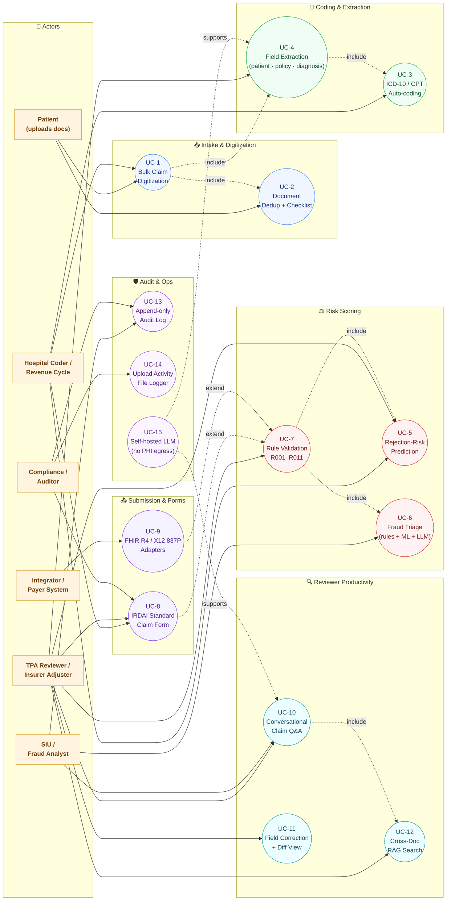

# ClaimGPT — Use Cases

> Who uses ClaimGPT, what they accomplish, and which microservice each capability maps to.
>
> See also: [docs/architecture.md](architecture.md) for the component & sequence diagrams.
>
> 📎 Crisp downloads of the diagram below: [SVG](img/use_cases.svg) · [2× PNG](img/use_cases.png)

---

## Use Case Diagram

**Legend**
- **Solid arrow** — actor uses the use case.
- **`-. include .->`** — the source use case always invokes the target as part of its flow (e.g. UC-7 always reads UC-5 + UC-6 results).
- **`-. extend .->`** — optional follow-on triggered when the target succeeds (e.g. UC-8 IRDAI form is generated after UC-7 passes).
- **`-. supports .->`** — cross-cutting capability that backs other use cases.

> Re-render after editing this section: `bash infra/scripts/render_diagrams.sh` (extends [docs/architecture.md](architecture.md) renderer pattern).

---

## 1. TPA / Insurer Claim Intake — *primary use case*

| # | Use case | What it does | Services |
|---|---|---|---|
| UC-1 | **Bulk claim digitization** | Convert uploaded PDFs / scans / docs into structured claim records via OCR + LLM extraction | `/ingress`, `/ocr`, `/parser` |
| UC-3 | **Auto-coding for adjudication** | Assign ICD-10 + CPT codes from free-text diagnoses & procedures (BioGPT + RAG over FAISS / BM25) | `/coding`, `/search` |
| UC-5 | **Rejection-risk scoring** | XGBoost + LightGBM ensemble outputs `rejection_score` and `risk_category` (LOW/MEDIUM/HIGH) so adjusters prioritise | `/predictor` |
| UC-6 | **Fraud triage** | 10 rule detectors (duplicate billing, code unbundling, provider velocity, identity mismatch…) + IsolationForest + LLM blend | `/fraud` |
| UC-7 | **Payer-rule validation** | R001–R011 gate-check; consumes predictor + fraud scores; promotes to `READY_FOR_REVIEW` or `NEEDS_ATTENTION` | `/validator`, `/workflow` |
| UC-8 | **One-click IRDAI Standard Claim Form** | Generate the fillable Reimbursement Claim Form (Part A + B) with 70+ AcroForm widgets; legacy `fpdf2` fallback | `/submission` |

## 2. Hospital / Provider Revenue Cycle

- **Pre-submission scrubbing** (UC-1, UC-3, UC-5, UC-7) — run the full pipeline before sending a claim to the payer; fix issues flagged by R001–R011 (missing diagnosis, missing patient name, low ML confidence, high fraud risk) to reduce denial rate.
- **Document checklist enforcement** (UC-2) — Ingress dedupes by SHA-256 content hash so the same discharge summary / bill / KYC isn't counted twice across encounters.
- **Coder assist** (UC-3 + UC-11) — `/coding` proposes ICD-10 / CPT codes; coders confirm or correct; corrections feed the field-correction loop back into training data.

## 3. Reviewer / Adjuster Productivity

- **Conversational claim Q&A** (UC-10) — ask *"what's the diagnosis on claim 1234?"*, *"show all HIGH-fraud claims this week"*, *"summarize discharge summary pages 3–5"* via the LangGraph chat agent over Postgres-checkpointed sessions.
- **Field-level corrections + diff** (UC-11) — TPA reviewers see the original parsed value vs the edited value (commit `c52f499`), with full audit trail.
- **Activity log on every upload** (UC-14) — rotating `logs/claim_uploads.txt` (log4net-style) with `UPLOAD_START / FILE_RECEIVED / UPLOAD_REJECTED / UPLOAD_HTTP_ERROR / UPLOAD_FAILURE / UPLOAD_PARTIAL / UPLOAD_SUCCESS` events for ops postmortems.

## 4. Compliance & Audit

- **Deterministic IRDAI form output** (UC-8) — produces the regulator-mandated Standard Health Insurance Claim Form (Part A + Part B) so submissions are audit-defensible.
- **Append-only audit log** (UC-13) in Postgres (`audit_log`) records every state transition: who uploaded, who corrected, who validated, predictor / fraud scores at validation time.
- **Rule-by-rule traceability** (UC-7) — Validator records *which* of R001–R011 triggered, with the upstream predictor / fraud scores that drove the decision.

## 5. Cross-Document Reimbursement Intelligence

- **RAG over the claim's own documents** (UC-12) — chat agent + `/search` lets users ask *"does the discharge summary mention diabetes?"*, *"is the surgery cost in the bill consistent with the CPT code?"*
- **Hybrid retrieval** — FAISS dense vectors + BM25 keyword search on ICD/CPT corpora, also reusable for claim-specific document search.

## 6. Integration / Data Exchange

- **FHIR R4 + X12 837P adapters** (UC-9) in `/submission` — push validated claims to downstream payer systems in standard formats.
- **Unified OpenAPI** — every service router is mounted under one Swagger at `/docs`, so a TPA portal or external integrator hits a single FastAPI gateway with one JWT.
- **Async by design** — Celery + Redis means a single ingress request can fan out to OCR + parser + downstream pipeline without blocking the caller.

## 7. Operations & MLOps

- **Self-hosted LLM** (UC-15, Ollama / vLLM) backs UC-4 (field extraction) and UC-10 (chat) — no PHI leaves the deployment.
- **LangFuse + OpenTelemetry** — every LLM span and HTTP hop is traced; quick blame for slow pipelines.
- **Built-in dependency hygiene** — `make verify-deps-all` (and the pre-push hook) keep all 11 services on a consistent stack across dev / CI / docker.

---

## End-to-end demo flow

1. **Upload** a discharge summary + bill PDF via the Web UI (`POST /ingress/claims`). [UC-1, UC-2]
2. **Workflow** auto-runs: `ocr → parse → code_suggest → predict → fraud_check → validate`. [UC-3 → UC-7]
3. **Reviewer dashboard** shows: parsed fields, suggested ICD/CPT codes, rejection score (e.g. `0.32 LOW`), fraud category (e.g. `MEDIUM` with indicators), validator outcome (e.g. `WARN: low_fraud_risk`).
4. Reviewer corrects 1–2 fields [UC-11], hits **Generate IRDAI Form** (`POST /submission/irda-pdf`) and downloads a fillable PDF that is submission-ready. [UC-8]
5. Optional: ask the chat agent *"why is fraud MEDIUM on this claim?"* and get a referenced answer back. [UC-10, UC-12]

---

## Use case → service / endpoint map

| UC | Endpoint(s) | Module |
|---|---|---|
| UC-1 | `POST /ingress/claims`, `POST /ingress/claims/{id}/documents` | `services/ingress/app/main.py` |
| UC-2 | (internal) SHA-256 dedup in Ingress | `services/ingress/app/main.py` |
| UC-3 | `POST /coding/code-suggest/{claim_id}` | `services/coding/app/main.py` |
| UC-4 | `POST /parser/parse/{claim_id}` | `services/parser/app/main.py` |
| UC-5 | `POST /predictor/predict/{claim_id}` | `services/predictor/app/main.py` |
| UC-6 | `POST /fraud/detect/{claim_id}` | `services/fraud/app/main.py` |
| UC-7 | `POST /validator/validate/{claim_id}` | `services/validator/app/main.py` |
| UC-8 | `POST /submission/irda-pdf?style=modern\|legacy&blank=0\|1` | `services/submission/app/main.py` |
| UC-9 | `POST /submission/fhir`, `POST /submission/x12-837p` | `services/submission/app/main.py` |
| UC-10 | `POST /chat`, `GET /chat/sessions/{id}` | `services/chat/app/main.py` |
| UC-11 | `PATCH /ingress/claims/{id}/fields` | `services/ingress/app/main.py` |
| UC-12 | `POST /search/hybrid`, `POST /search/icd10`, `POST /search/cpt` | `services/search/app/main.py` |
| UC-13 | (internal) `audit_log` table writes | `libs/shared/models.py` |
| UC-14 | `logs/claim_uploads.txt` (rotating) | `libs/observability/file_logger.py` |
| UC-15 | (infra) Ollama / vLLM endpoint | `services/parser`, `services/coding`, `services/chat` |
